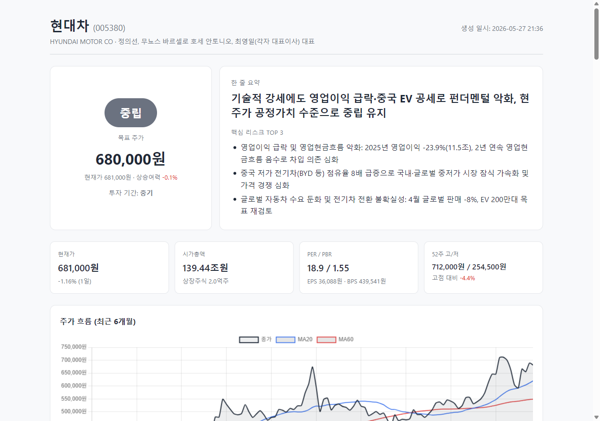
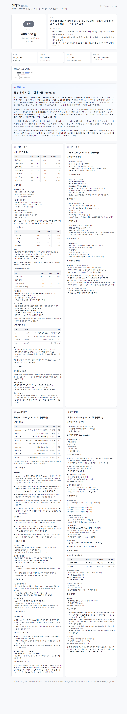

# KOSPI Stock Analysis Agent Team


KOSPI 개별 종목 투자 분석 Report 자동 생성 Multi-agent 시스템.



## 구성

**Master Agent + Sub-agent 4개 (MVP)**

| Agent | 역할 |
|---|---|
| 펀더멘털 분석가 | 재무제표, ROE/PER/PBR, 성장성·수익성·안정성 |
| 기술적 분석가 | 차트 패턴, 이평선/RSI/MACD, 거래량 |
| 뉴스·공시 분석가 | DART 공시, 최근 뉴스 호재/악재 |
| 밸류에이션 전문가 | DCF, 상대가치, 목표주가 |
| **Master Agent** | 4개 분석 종합 → 투자의견·목표주가·리스크 |

## 설치

```powershell
python -m pip install -r requirements.txt
copy .env.example .env
# .env 파일을 열어 ANTHROPIC_API_KEY와 DART_API_KEY 입력
```

DART API Key는 [opendart.fss.or.kr](https://opendart.fss.or.kr/) 무료 가입 후 발급.

## 사용법

```powershell
python -m src.main 005930        # 삼성전자
python -m src.main 035420        # NAVER
python -m src.main 005380        # 현대차
```

리포트는 `reports/{종목명}_{날짜}.html` 로 저장됩니다.

## 리포트 예시

> 현대차(005380) 분석 리포트 — 투자의견·목표주가·핵심 리스크·주가 차트·4개 분야 상세 분석 포함



## 프로젝트 구조

```
src/
├── main.py              # CLI 진입점
├── config.py            # 환경설정
├── master_agent.py      # Master Agent (오케스트레이션)
├── agents/              # 4개 Sub-agent 정의
├── data/                # DART, KRX, 뉴스 데이터 클라이언트
└── report/              # HTML 리포트 생성 (Jinja2)
```

## 기술 스택

- Python 3.10+
- [Claude Agent SDK](https://github.com/anthropics/claude-agent-sdk-python)
- [pykrx](https://github.com/sharebook-kr/pykrx) — KRX 데이터
- DART OpenAPI — 공시·재무제표
- Jinja2 + Chart.js — HTML 리포트
